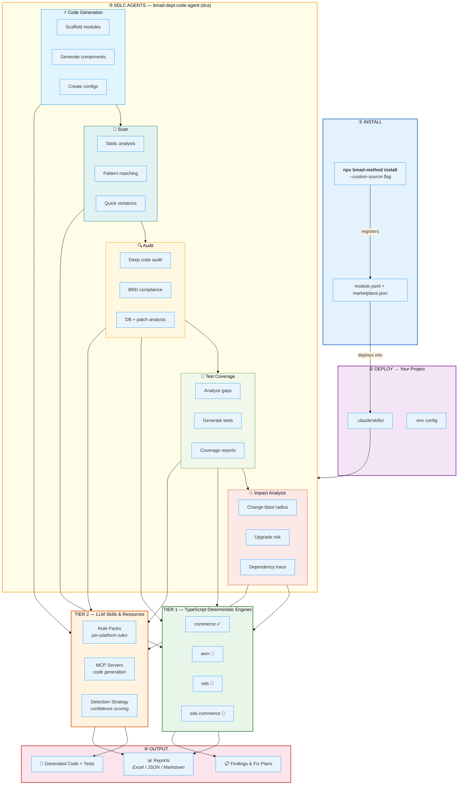

# BMAD DEPT Code Agent

[](https://github.com/mayur434/bmad-dept-code-agent)

---

## The BMAD Framework

[BMAD Method](https://github.com/bmadcode/bmad-method) is a modular AI-agent framework that lets you compose specialized skills into any AI coding tool (Claude Code, Cursor, VS Code Copilot, etc.). Modules are installed into your project with a single CLI command and extend your agent with domain-specific knowledge, scripts, and workflows — no custom infrastructure needed.

This repository is a **custom BMAD module** (`dca`) that plugs directly into the framework.

---

## What We Built

A multi-agent AI suite purpose-built for **Adobe platform** projects — Commerce, AEMaaCS, EDS, and EDS+Commerce.

### Coverage Matrix

| Agent | Commerce | AEMaaCS | EDS | EDS+Commerce |
|-------|:--------:|:-------:|:---:|:------------:|
| **Audit** (Scanner + LLM) | ✅ | 🔲 | 🔲 | 🔲 |
| **Code Generation** (MCP + LLM) | ✅ | ✅ | 🔲 | 🔲 |
| **Test Coverage** (Scanner + LLM) | 🔲 | 🔲 | 🔲 | 🔲 |
| **Impact Analysis** (Scanner + LLM) | 🔲 | 🔲 | 🔲 | 🔲 |
| **Scan** (Scanner + LLM) | 🔲 | 🔲 | 🔲 | 🔲 |

> ✅ = Implemented &nbsp;&nbsp; 🔲 = Scaffolded, coming next

### What Each Agent Does

| Agent | Tier 1 (TypeScript Scanner) | Tier 2 (LLM Skills) |
|-------|----------------------------|---------------------|
| **Audit** | 42+ category static scan → Excel report | Architecture, data flow, business logic deep analysis |
| **Code Generation** | — | MCP-powered (AEMaaCS) + LLM skills (AMS/Commerce) code gen |
| **Test Coverage** | Coverage gap detection, priority scoring | Generates unit/integration/functional tests |
| **Impact Analysis** | Dependency tracing, blast radius mapping | Risk assessment, upgrade compatibility |
| **Scan** | Fast violation detection | Pattern matching, contextual analysis |

### Module Architecture



> **Reading the diagram:** Follow the numbered layers ① → ④. Agents are ordered left-to-right in SDLC sequence: you **generate** code first, **scan** for quick violations, **audit** in depth, verify **test coverage**, then assess **impact** of changes. Each agent uses Tier 1 (deterministic TypeScript scanners) + Tier 2 (LLM-powered skills). The Commerce engine is fully implemented; other platforms are scaffolded (🔲).

---

### Extending the Engine Layer — How It Works

Each agent's Tier 1 uses a **pluggable TypeScript engine architecture**. The Commerce engine is the reference implementation (benchmark). To add a new platform, you replicate this pattern.

#### Benchmark: Adobe Commerce Engine

```
scripts/engines/commerce/
├── audit.ts              ← Entry point (CLI arg parsing, orchestration)
├── config.json           ← Project-specific overrides (paths, thresholds)
└── lib/
    ├── scanner/
    │   ├── index.ts      ← Main scanner class (orchestrates 42+ scan categories)
    │   ├── types.ts      ← Finding, FindingsMap, Thresholds interfaces
    │   ├── context.ts    ← File discovery (PHP, XML, PHTML via fast-glob)
    │   ├── scans-code.ts     ← Security, Performance, Deprecated, Caching...
    │   ├── scans-arch.ts     ← DI, Plugins, Crons, GraphQL, Config...
    │   ├── scans-infra.ts    ← Cloud, PHP deep, Observers, Metrics...
    │   ├── scans-business.ts ← Business logic, MSI, Admin security...
    │   ├── scans-quality.ts  ← Standards, Validation, Compat, XSD...
    │   └── db-analysis.ts    ← SQL dump parsing, schema validation
    ├── brd_analyzer.ts   ← BRD requirement → code impact mapping
    ├── brd_parser.ts     ← .docx BRD document parser
    ├── bug_parser.ts     ← .xlsx bug report parser
    ├── impact.ts         ← Patch/upgrade breaking-change analysis
    ├── report.ts         ← Excel report generation (ExcelJS)
    ├── expert.ts         ← Expert-level finding enrichment
    └── styles.ts         ← Excel styling constants
```

#### How to Add a New Engine

1. **Create the engine folder:** `scripts/engines/<platform>/`
2. **Implement the interface** from `shared/base.ts`:
   ```typescript
   // shared/base.ts exposes:
   export interface AuditEngine {
     readonly PLATFORM_ID: string;
     readonly PLATFORM_NAME: string;
     detect(path: string): boolean;
     scan(): FindingsMap;
     generateReport(findings: FindingsMap, outputPath: string): Promise<void>;
   }
   ```
3. **Register in `engines/registry.ts`:**
   ```typescript
   register("your-platform", "Description", detectFn, "engines/your-platform/audit");
   ```
4. **Auto-detection** — implement a `detect()` function that checks for platform-specific markers (e.g., `pom.xml` + `ui.apps` for AEM).

The dispatcher (`run.ts`) handles everything else — CLI parsing, engine resolution, output routing. Your engine just needs to implement `detect()`, `scan()`, and `generateReport()`.

---

## Install

### Prerequisites

- **Node.js** v20.12+
- A target project where you want the agents installed

### Fresh Install (from Git)

```bash
cd /path/to/your-project

npx bmad-method install \
  --directory . \
  --modules bmm,bmb \
  --custom-source https://github.com/mayur434/bmad-dept-code-agent.git \
  --tools claude-code \
  --yes
```

### Fresh Install (from local clone)

```bash
npx bmad-method install \
  --directory . \
  --modules bmm,bmb \
  --custom-source /path/to/bmad-dept-code-agent/skills \
  --tools claude-code \
  --yes
```

After install, dependencies are auto-installed on first use. To pre-install manually:

```bash
cd .claude/skills/bmad-dept-code-audit-agent/scripts && npm install
```

---

## Update

```bash
cd /path/to/your-project

# Quick update — preserves settings, syncs module files only
npx bmad-method install \
  --directory . \
  --action quick-update \
  --custom-source https://github.com/mayur434/bmad-dept-code-agent.git \
  --yes

# Full update — re-resolves everything, allows config changes
npx bmad-method install \
  --directory . \
  --action update \
  --custom-source https://github.com/mayur434/bmad-dept-code-agent.git \
  --yes
```

Then reinstall deps:

```bash
cd .claude/skills/bmad-dept-code-audit-agent/scripts && npm install
```

### Uninstall

```bash
npx bmad-method uninstall --directory .
```

### Useful Flags

| Flag | Purpose |
|------|---------|
| `--action quick-update` | Fast sync — preserves all config |
| `--action update` | Full update — can modify modules/config |
| `--custom-source <url\|path>` | Git URL or local `skills/` folder path |
| `--yes` | Non-interactive, accept defaults |
| `--channel next` | Use latest HEAD instead of stable tag |
| `--pin CODE=TAG` | Pin module to specific release tag |
| `--set module.key=value` | Override config non-interactively |

---

## Configuration

### Supported Engines

| Engine | Platform | Status |
|--------|----------|--------|
| `commerce` | Adobe Commerce / Magento 2 | ✅ Ready |
| `aem` | AEM as a Cloud Service | 🔲 Planned |
| `eds` | Edge Delivery Services | 🔲 Planned |
| `eds-commerce` | EDS + Commerce Hybrid | 🔲 Planned |

### Standalone Scanner (without BMAD)

Run the TypeScript scanner directly:

```bash
cd skills/bmad-dept-code-audit-agent/scripts && npm install

# Auto-detect platform
npx ts-node run.ts --path /path/to/your/project --name "Project Name"

# Explicit engine
npx ts-node run.ts --engine commerce --path /path/to/project

# List available engines
npx ts-node run.ts --list-engines
```

---

## Getting Started

See **[MANUAL.md](MANUAL.md)** for full operational details:

- Repository structure and key files
- How to create a new skill module from scratch
- Naming conventions and file contracts
- The SKILL.md / GUIDE.md / customize.toml relationship
- Pre-flight checklist before publishing

---

## Prompts

See **[PROMPTS.md](PROMPTS.md)** for the complete prompt reference organized by agent and platform.

Quick examples to get going:

```text
# Audit (Commerce)
audit my project
scan my project and name it "Client Name"
scan my project with DB dump at /path/to/dump.sql
deep audit my project
full audit my project

# Code Generation (AEMaaCS)
create a new AEM component called Hero Banner
generate a Sling Model for the Article component
create Cloud Manager pipeline configuration

# Code Generation (Commerce)
create a new Commerce module Acme_CustomShipping
create an after plugin on Magento\Catalog\Model\Product::getName
add a GraphQL resolver for querying custom entity by ID

# Test Coverage
analyze test coverage
generate tests for the Checkout module
full test coverage
create test plan
```

After an audit completes, follow up with:

```text
summarize the audit findings
show me all CRITICAL severity items
create a fix plan for the critical items
estimate effort to fix all HIGH and CRITICAL findings
```

---

## Folder Structure

```
bmad-dept-code-agent/
├── README.md                         ← You are here
├── MANUAL.md                         ← Operational guide
├── PROMPTS.md                        ← Full prompt reference
└── skills/
    ├── module.yaml                   ← BMAD module manifest
    ├── module-help.csv               ← Menu/capability registry
    ├── bmad-dept-code-audit-agent/
    ├── bmad-dept-code-generation-agent/
    ├── bmad-dept-code-test-coverage-agent/
    ├── bmad-dept-code-impact-analysis-agent/
    └── bmad-dept-code-scan-agent/
```

Each skill folder contains:

| File | Role |
|------|------|
| `SKILL.md` | Instructions TO the AI agent — workflows, modes, triggers |
| `GUIDE.md` | Instructions FOR humans — setup, examples |
| `customize.toml` | Activation keywords, named commands, script paths |
| `assets/` | Module manifest + capability registry |
| `resources/` | Rule packs, scoring models, detection strategies |
| `templates/` | Report output templates |
| `scripts/` | TypeScript engines |

---

## License

MIT
